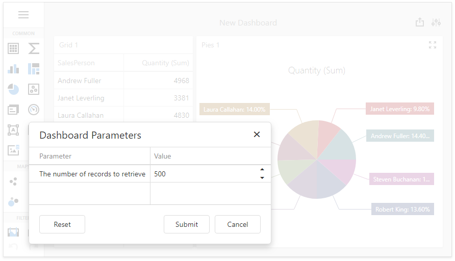

<!-- default file list -->
*Files to look at*:
* [CustomObjectDataSourceCustomFillService.cs](./CS/DXWebApplication5/CustomObjectDataSourceCustomFillService.cs) (VB: [CustomObjectDataSourceCustomFillService.vb](./VB/DXWebApplication5/CustomObjectDataSourceCustomFillService.vb))
* [SalesPersonData.cs](./CS/DXWebApplication5/SalesPersonData.cs) (VB: [SalesPersonData.vb](./VB/DXWebApplication5/SalesPersonData.vb))
* [Default.aspx](./CS/DXWebApplication5/Default.aspx) (VB: [Default.aspx](./VB/DXWebApplication5/Default.aspx))
* [Default.aspx.cs](./CS/DXWebApplication5/Default.aspx.cs) (VB: [Default.aspx.vb](./VB/DXWebApplication5/Default.aspx.vb))
<!-- default file list end -->
# ASPxDashboard - How to Use a Service to Fill the ObjectDataSource
<!-- run online -->
**[[Run Online]](https://codecentral.devexpress.com/170140470/)**
<!-- run online end -->

This example shows how to bind the [ASP.NET Web Forms Dashboard Control](https://docs.devexpress.com/Dashboard/16976) to the [Object Data Source](https://docs.devexpress.com/Dashboard/DevExpress.DashboardCommon.DashboardObjectDataSource) and supply it with data using a custom fill service by implementing a [IObjectDataSourceCustomFillService](https://docs.devexpress.com/Dashboard/DevExpress.DashboardCommon.IObjectDataSourceCustomFillService) interface. In this example, the [ObjectDataSourceFillParameters.Parameters](https://docs.devexpress.com/Dashboard/DevExpress.DashboardCommon.ObjectDataSourceFillParameters.Parameters) collection of dashboard parameters is used to load the specified number of records.

